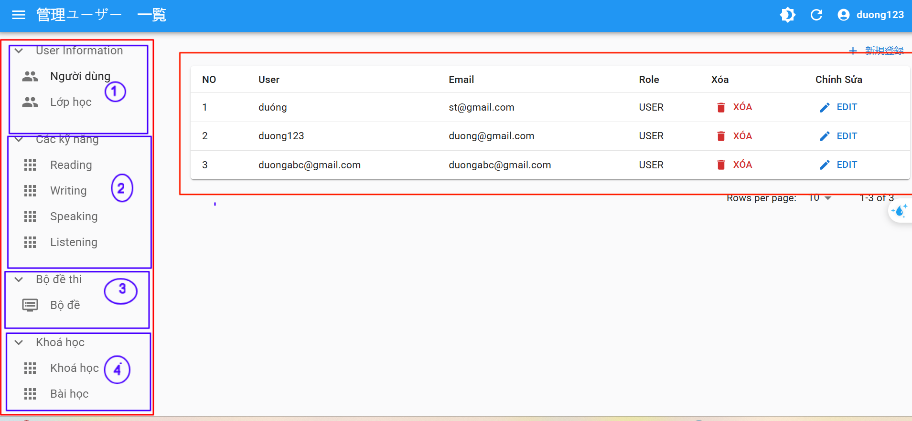

# Tổng quan 

Màn hình Tổng quát của CMS

Đây là màn hình của trang quản lý của phần mềm.
**gồm có:** 

  **SideBar:** khung bên trái ( có 4 mục)

  **Danh sách nội dung** : Khung bên phải 

## 1. User INFOMATION

Ở phần này có 2 muc chính là **người dùng** VÀ **Lớp học**

### Người dùng:
sẽ gồm tất cả thông tìn về user trong hệ thống: tên , sdt ,CCCD, lớp , email , vai trò,...
### Lớp học:
Gồm : mã lớp , ngày tháng bắt đầu và kết thúc , các bài học của lớp 

## 2. Các kỹ năng 

Gồm 4 kỹ năng trong mục này listening, reading, [speaking](http://localhost:3000/docs/Aptis/CMS/four-skill#1-man-hinh-speaking), writing.

Ỏ Đây bạn có thêm các nội dung đề bài cho 4 kỹ năng trên.

The classic template will automatically be added to your project after you run the command:

## 3. Bộ Đề

Sẽ Tổng hợp bộ để từ 4 kỹ năng trên , và sẽ được hiển thị ra ngoài web là phần bộ đề key.

## 4. Khóa học

#### 1.Tạo khóa học 
#### 2. tạo các nội dung bài học cho khóa học