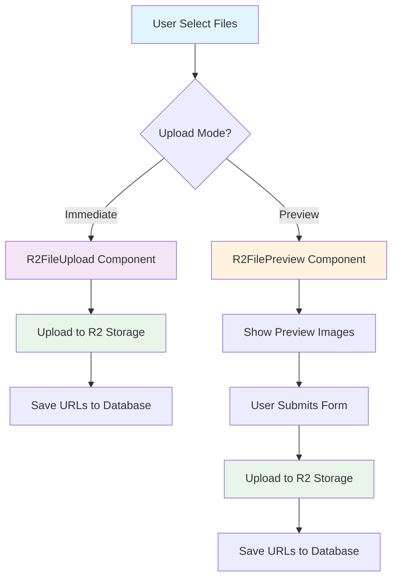
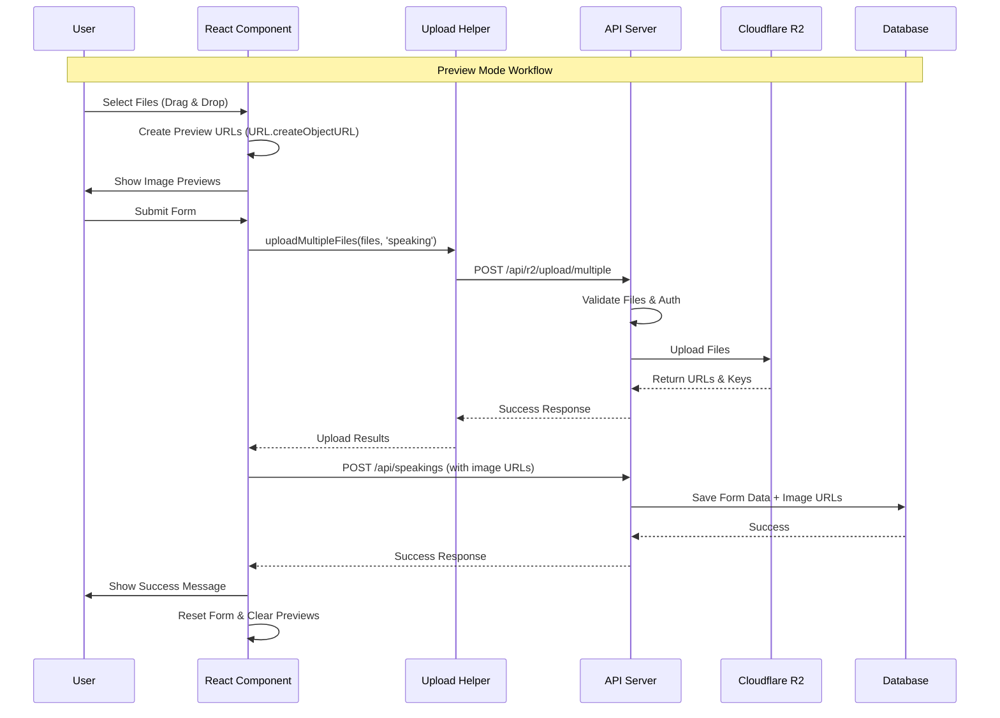

# 📁 Cloudflare R2 File Upload System

> Hệ thống upload file scalable và clean sử dụng Cloudflare R2 storage với preview functionality

## 🎯 Tổng Quan Hệ Thống

Hệ thống này cung cấp giải pháp upload file hoàn chỉnh với 2 modes chính:

- **Immediate Upload**: Upload ngay lập tức khi chọn file
- **Preview Mode**: Hiển thị preview, chỉ upload khi submit form

## 🏗️ Kiến Trúc Hệ Thống

```
📦 R2 File Upload System
├── 🔧 Backend Infrastructure
│   ├── r2.config.js         # R2 Client Configuration
│   ├── r2.service.js        # Business Logic Layer
│   ├── r2.controller.js     # HTTP Request Handlers
│   └── routes/r2/index.js   # API Endpoints
├── 🎨 Frontend Components
│   ├── R2FileUpload.tsx     # Immediate Upload Mode
│   ├── R2FilePreview.tsx    # Preview Mode
│   └── r2UploadHelper.ts    # Upload Service Helper
└── 🔄 Integration
    └── Form Integration     # Speaking/Reading/Writing Forms
```

## 🔄 Workflow Diagram



## 🛠️ Cài Đặt & Cấu Hình

### 1. Environment Variables (.env)

```bash
# Cloudflare R2 Configuration
R2_ACCOUNT_ID=your_account_id
R2_ACCESS_KEY_ID=your_access_key
R2_SECRET_ACCESS_KEY=your_secret_key
R2_BUCKET_NAME=your_bucket_name
R2_REGION=auto
R2_ENDPOINT=https://your-account-id.r2.cloudflarestorage.com
R2_PUBLIC_URL=https://your-domain.com
```

### 2. Backend Dependencies

```bash
cd server
npm install @aws-sdk/client-s3 @aws-sdk/s3-request-presigner multer
```

### 3. Frontend Dependencies

```bash
cd aptisUI
npm install react-dropzone @mui/material @mui/icons-material
```

## 📋 Backend Implementation

### 1. R2 Configuration (`server/src/configs/r2.config.js`)

```javascript
const { S3Client } = require("@aws-sdk/client-s3");

class R2Config {
  constructor() {
    this.validateConfig();
    this.client = this.createClient();
  }

  validateConfig() {
    const required = [
      "R2_ACCOUNT_ID",
      "R2_ACCESS_KEY_ID",
      "R2_SECRET_ACCESS_KEY",
      "R2_BUCKET_NAME",
    ];

    const missing = required.filter((key) => !process.env[key]);
    if (missing.length > 0) {
      throw new Error(`Missing R2 config: ${missing.join(", ")}`);
    }
  }

  createClient() {
    return new S3Client({
      region: process.env.R2_REGION || "auto",
      endpoint: process.env.R2_ENDPOINT,
      credentials: {
        accessKeyId: process.env.R2_ACCESS_KEY_ID,
        secretAccessKey: process.env.R2_SECRET_ACCESS_KEY,
      },
    });
  }

  getClient() {
    return this.client;
  }

  getBucketName() {
    return process.env.R2_BUCKET_NAME;
  }
}

module.exports = new R2Config();
```

### 2. R2 Service Layer (`server/src/services/r2.service.js`)

```javascript
const {
  PutObjectCommand,
  DeleteObjectCommand,
  ListObjectsV2Command,
} = require("@aws-sdk/client-s3");
const r2Config = require("../configs/r2.config");
const crypto = require("crypto");

class R2Service {
  constructor() {
    this.client = r2Config.getClient();
    this.bucketName = r2Config.getBucketName();
  }

  /**
   * Upload single file to R2
   * @param {Buffer} fileBuffer - File content
   * @param {string} originalName - Original filename
   * @param {string} mimeType - File MIME type
   * @param {string} fileType - Category (speaking/reading/etc)
   * @returns {Object} Upload result with URL and key
   */
  async uploadFile(fileBuffer, originalName, mimeType, fileType = "general") {
    try {
      const fileName = this.generateUniqueFilename(originalName, fileType);

      const command = new PutObjectCommand({
        Bucket: this.bucketName,
        Key: fileName,
        Body: fileBuffer,
        ContentType: mimeType,
      });

      await this.client.send(command);

      return {
        success: true,
        url: `${process.env.R2_PUBLIC_URL}/${fileName}`,
        key: fileName,
        originalName: originalName,
        size: fileBuffer.length,
        mimeType: mimeType,
      };
    } catch (error) {
      throw new Error(`Upload failed: ${error.message}`);
    }
  }

  /**
   * Generate unique filename with organized structure
   * Format: fileType/YYYY/MM/DD/timestamp_random_originalname
   */
  generateUniqueFilename(originalName, fileType) {
    const now = new Date();
    const year = now.getFullYear();
    const month = String(now.getMonth() + 1).padStart(2, "0");
    const day = String(now.getDate()).padStart(2, "0");

    const timestamp = Date.now();
    const randomString = crypto.randomBytes(8).toString("hex");
    const ext = originalName.split(".").pop();
    const nameWithoutExt = originalName.replace(`.${ext}`, "");

    return `${fileType}/${year}/${month}/${day}/${timestamp}_${randomString}_${nameWithoutExt}.${ext}`;
  }

  /**
   * Delete file from R2
   */
  async deleteFile(key) {
    try {
      const command = new DeleteObjectCommand({
        Bucket: this.bucketName,
        Key: key,
      });

      await this.client.send(command);
      return { success: true, key };
    } catch (error) {
      throw new Error(`Delete failed: ${error.message}`);
    }
  }
}

module.exports = new R2Service();
```

### 3. R2 Controller (`server/src/controllers/r2.controller.js`)

```javascript
const r2Service = require("../services/r2.service");
const { successResponse, errorResponse } = require("../cores/success.response");

class R2Controller {
  /**
   * Upload single file
   * POST /api/r2/upload/single
   */
  async uploadSingle(req, res) {
    try {
      if (!req.file) {
        return errorResponse(res, "No file provided", 400);
      }

      const { fileType = "general" } = req.body;
      const { buffer, originalname, mimetype } = req.file;

      const result = await r2Service.uploadFile(
        buffer,
        originalname,
        mimetype,
        fileType
      );

      return successResponse(res, "File uploaded successfully", result);
    } catch (error) {
      return errorResponse(res, error.message, 500);
    }
  }

  /**
   * Upload multiple files
   * POST /api/r2/upload/multiple
   */
  async uploadMultiple(req, res) {
    try {
      if (!req.files || req.files.length === 0) {
        return errorResponse(res, "No files provided", 400);
      }

      const { fileType = "general" } = req.body;
      const uploadPromises = req.files.map((file) =>
        r2Service.uploadFile(
          file.buffer,
          file.originalname,
          file.mimetype,
          fileType
        )
      );

      const results = await Promise.allSettled(uploadPromises);

      const successful = results
        .filter((result) => result.status === "fulfilled")
        .map((result) => result.value);

      const failed = results
        .filter((result) => result.status === "rejected")
        .map((result) => result.reason.message);

      return successResponse(res, "Upload completed", {
        success: failed.length === 0,
        successful,
        failed,
        total: req.files.length,
      });
    } catch (error) {
      return errorResponse(res, error.message, 500);
    }
  }

  /**
   * Delete file
   * DELETE /api/r2/file/:key
   */
  async deleteFile(req, res) {
    try {
      const { key } = req.params;
      const decodedKey = decodeURIComponent(key);

      const result = await r2Service.deleteFile(decodedKey);
      return successResponse(res, "File deleted successfully", result);
    } catch (error) {
      return errorResponse(res, error.message, 500);
    }
  }
}

module.exports = new R2Controller();
```

### 4. API Routes (`server/src/routes/r2/index.js`)

```javascript
const express = require("express");
const multer = require("multer");
const r2Controller = require("../../controllers/r2.controller");
const { authentication } = require("../../auth/authUtils");

const router = express.Router();

// Multer configuration for memory storage
const upload = multer({
  storage: multer.memoryStorage(),
  limits: {
    fileSize: 100 * 1024 * 1024, // 100MB
  },
  fileFilter: (req, file, cb) => {
    // Allow images and common file types
    const allowedTypes = [
      "image/jpeg",
      "image/png",
      "image/gif",
      "image/webp",
      "audio/mpeg",
      "audio/wav",
      "audio/mp3",
      "video/mp4",
      "application/pdf",
    ];

    if (allowedTypes.includes(file.mimetype)) {
      cb(null, true);
    } else {
      cb(new Error(`File type ${file.mimetype} not allowed`), false);
    }
  },
});

// All routes require authentication
router.use(authentication);

// Upload routes
router.post("/upload/single", upload.single("file"), r2Controller.uploadSingle);

router.post(
  "/upload/multiple",
  upload.array("files", 10),
  r2Controller.uploadMultiple
);

// Delete route
router.delete("/file/:key", r2Controller.deleteFile);

module.exports = router;
```

## 🎨 Frontend Implementation

### 1. R2FilePreview Component (Preview Mode)

```tsx
import React, { useState, useCallback } from "react";
import { Box, Typography, Alert, Chip, IconButton } from "@mui/material";
import { CloudUpload, Delete, Visibility } from "@mui/icons-material";
import { useDropzone } from "react-dropzone";

interface PreviewFile {
  file: File;
  previewUrl: string;
  id: string;
}

interface R2FilePreviewProps {
  fileType?: "listening" | "speaking" | "reading" | "writing" | "general";
  multiple?: boolean;
  maxFiles?: number;
  maxSize?: number;
  acceptedFileTypes?: string[];
  onFilesChange?: (files: File[]) => void;
  onPreviewUrlsChange?: (urls: string[]) => void;
  initialImages?: string[];
}

const R2FilePreview: React.FC<R2FilePreviewProps> = ({
  fileType = "general",
  multiple = false,
  maxFiles = 10,
  maxSize = 100 * 1024 * 1024, // 100MB
  acceptedFileTypes = ["image/jpeg", "image/png", "image/gif", "image/webp"],
  onFilesChange,
  onPreviewUrlsChange,
  initialImages = [],
}) => {
  const [previewFiles, setPreviewFiles] = useState<PreviewFile[]>([]);
  const [error, setError] = useState<string | null>(null);

  // Drag & Drop Handler
  const onDrop = useCallback(
    (acceptedFiles: File[]) => {
      if (acceptedFiles.length === 0) return;

      setError(null);

      try {
        const newPreviews: PreviewFile[] = acceptedFiles.map((file, index) => ({
          file,
          previewUrl: URL.createObjectURL(file), // Tạo preview URL
          id: `new-${Date.now()}-${index}`,
        }));

        let updatedPreviews: PreviewFile[];

        if (multiple) {
          // Multiple files mode
          const totalCount = previewFiles.length + newPreviews.length;
          if (totalCount > maxFiles) {
            setError(`Maximum ${maxFiles} files allowed`);
            return;
          }
          updatedPreviews = [...previewFiles, ...newPreviews];
        } else {
          // Single file mode
          updatedPreviews = newPreviews.slice(0, 1);
        }

        setPreviewFiles(updatedPreviews);

        // Notify parent components
        const newFiles = updatedPreviews
          .filter((p) => p.file)
          .map((p) => p.file);
        const allUrls = updatedPreviews.map((p) => p.previewUrl);

        onFilesChange?.(newFiles);
        onPreviewUrlsChange?.(allUrls);
      } catch (err) {
        setError(`Preview failed: ${err.message}`);
      }
    },
    [previewFiles, multiple, maxFiles, onFilesChange, onPreviewUrlsChange]
  );

  const { getRootProps, getInputProps, isDragActive } = useDropzone({
    onDrop,
    accept: acceptedFileTypes.reduce((acc, type) => {
      acc[type] = [];
      return acc;
    }, {} as Record<string, string[]>),
    multiple,
    maxFiles: multiple ? maxFiles : 1,
    maxSize,
  });

  // Remove file handler
  const removeFile = (id: string) => {
    const updatedPreviews = previewFiles.filter((p) => p.id !== id);
    setPreviewFiles(updatedPreviews);

    const newFiles = updatedPreviews.filter((p) => p.file).map((p) => p.file);
    const allUrls = updatedPreviews.map((p) => p.previewUrl);

    onFilesChange?.(newFiles);
    onPreviewUrlsChange?.(allUrls);

    // Cleanup object URL
    const removedFile = previewFiles.find((p) => p.id === id);
    if (removedFile && removedFile.file) {
      URL.revokeObjectURL(removedFile.previewUrl);
    }
  };

  return (
    <Box>
      {/* Drag & Drop Upload Area */}
      <Box
        {...getRootProps()}
        sx={{
          border: "2px dashed",
          borderColor: isDragActive ? "primary.main" : "grey.300",
          borderRadius: 2,
          padding: 4,
          textAlign: "center",
          cursor: "pointer",
          backgroundColor: isDragActive ? "action.hover" : "background.paper",
          transition: "all 0.3s ease",
          "&:hover": {
            borderColor: "primary.main",
            backgroundColor: "action.hover",
          },
        }}
      >
        <input {...getInputProps()} />
        <CloudUpload sx={{ fontSize: 48, color: "grey.400", mb: 2 }} />

        <Typography variant="h6" gutterBottom>
          {isDragActive
            ? "Drop files here..."
            : `Click or drag files to preview (${fileType})`}
        </Typography>
        <Typography variant="body2" color="warning.main" sx={{ mt: 1 }}>
          ⚠️ Files will be uploaded when you submit the form
        </Typography>
      </Box>

      {/* Error Display */}
      {error && (
        <Alert severity="error" sx={{ mt: 2 }} onClose={() => setError(null)}>
          {error}
        </Alert>
      )}

      {/* Preview Images Grid */}
      {previewFiles.length > 0 && (
        <Box sx={{ mt: 3 }}>
          <Typography variant="h6" gutterBottom>
            Preview Files ({previewFiles.length})
          </Typography>

          <Box
            sx={{
              display: "grid",
              gridTemplateColumns: "repeat(auto-fill, minmax(200px, 1fr))",
              gap: 2,
              mt: 2,
            }}
          >
            {previewFiles.map((preview) => (
              <Box
                key={preview.id}
                sx={{
                  position: "relative",
                  border: "1px solid",
                  borderColor: "grey.300",
                  borderRadius: 1,
                  overflow: "hidden",
                  backgroundColor: "background.paper",
                }}
              >
                {/* Image Preview */}
                <Box
                  sx={{
                    width: "100%",
                    height: "150px",
                    backgroundImage: `url(${preview.previewUrl})`,
                    backgroundSize: "cover",
                    backgroundPosition: "center",
                    position: "relative",
                  }}
                >
                  {/* Action Buttons */}
                  <Box
                    sx={{
                      position: "absolute",
                      top: 8,
                      right: 8,
                      display: "flex",
                      gap: 1,
                    }}
                  >
                    <IconButton
                      size="small"
                      onClick={() => window.open(preview.previewUrl, "_blank")}
                      sx={{
                        backgroundColor: "rgba(255, 255, 255, 0.8)",
                        "&:hover": {
                          backgroundColor: "rgba(255, 255, 255, 0.9)",
                        },
                      }}
                    >
                      <Visibility fontSize="small" />
                    </IconButton>
                    <IconButton
                      size="small"
                      color="error"
                      onClick={() => removeFile(preview.id)}
                      sx={{
                        backgroundColor: "rgba(255, 255, 255, 0.8)",
                        "&:hover": {
                          backgroundColor: "rgba(255, 255, 255, 0.9)",
                        },
                      }}
                    >
                      <Delete fontSize="small" />
                    </IconButton>
                  </Box>
                </Box>

                {/* File Info */}
                <Box sx={{ p: 1 }}>
                  <Typography variant="body2" noWrap>
                    {preview.file ? preview.file.name : "Existing image"}
                  </Typography>
                  <Box sx={{ display: "flex", gap: 1, mt: 1 }}>
                    {preview.file && (
                      <>
                        <Chip
                          label={preview.file.type}
                          size="small"
                          color="primary"
                        />
                        <Chip
                          label={`${(preview.file.size / 1024 / 1024).toFixed(
                            2
                          )} MB`}
                          size="small"
                          variant="outlined"
                        />
                      </>
                    )}
                    <Chip
                      label={preview.file ? "New" : "Existing"}
                      size="small"
                      color={preview.file ? "secondary" : "default"}
                      variant="outlined"
                    />
                  </Box>
                </Box>
              </Box>
            ))}
          </Box>
        </Box>
      )}
    </Box>
  );
};

export default R2FilePreview;
```

### 2. Upload Helper Service (`aptisUI/src/services/r2UploadHelper.ts`)

```typescript
const API_BASE_URL = "http://localhost:3000/api/r2";

class R2UploadHelper {
  private getAuthToken(): string | null {
    return localStorage.getItem("token") || sessionStorage.getItem("token");
  }

  private getHeaders() {
    const token = this.getAuthToken();
    return {
      Authorization: token ? `Bearer ${token}` : "",
    };
  }

  /**
   * Upload single file to R2
   */
  async uploadSingleFile(file: File, fileType: string = "general") {
    try {
      const formData = new FormData();
      formData.append("file", file);
      formData.append("fileType", fileType);

      const response = await fetch(`${API_BASE_URL}/upload/single`, {
        method: "POST",
        headers: this.getHeaders(),
        body: formData,
      });

      if (!response.ok) {
        throw new Error(`Upload failed: ${response.statusText}`);
      }

      const result = await response.json();
      return result.metadata;
    } catch (error) {
      console.error("Single file upload error:", error);
      throw error;
    }
  }

  /**
   * Upload multiple files to R2
   */
  async uploadMultipleFiles(files: File[], fileType: string = "general") {
    try {
      const formData = new FormData();
      files.forEach((file) => {
        formData.append("files", file);
      });
      formData.append("fileType", fileType);

      const response = await fetch(`${API_BASE_URL}/upload/multiple`, {
        method: "POST",
        headers: this.getHeaders(),
        body: formData,
      });

      if (!response.ok) {
        throw new Error(`Upload failed: ${response.statusText}`);
      }

      const result = await response.json();
      return result.metadata;
    } catch (error) {
      console.error("Multiple files upload error:", error);
      throw error;
    }
  }

  /**
   * Delete file from R2
   */
  async deleteFile(key: string) {
    try {
      const encodedKey = encodeURIComponent(key);
      const response = await fetch(`${API_BASE_URL}/file/${encodedKey}`, {
        method: "DELETE",
        headers: {
          ...this.getHeaders(),
          "Content-Type": "application/json",
        },
      });

      if (!response.ok) {
        throw new Error(`Delete failed: ${response.statusText}`);
      }

      const result = await response.json();
      return result.metadata;
    } catch (error) {
      console.error("Delete file error:", error);
      throw error;
    }
  }
}

export default new R2UploadHelper();
```

## 🔄 Form Integration Example

### Speaking Form Integration

```tsx
import React, { useState } from "react";
import { R2FilePreview } from "../components/R2FileUpload";
import r2UploadHelper from "../services/r2UploadHelper";

const SpeakingForm: React.FC = () => {
  const [selectedFiles, setSelectedFiles] = useState<File[]>([]);
  const [previewImageUrls, setPreviewImageUrls] = useState<string[]>([]);
  const [isUploading, setIsUploading] = useState(false);

  const onSubmit = async (formData: any) => {
    try {
      setIsUploading(true);

      // 1. Upload files to R2 if any selected
      let uploadedImageUrls = [];
      let uploadedImageKeys = [];

      if (selectedFiles.length > 0) {
        const uploadResults = await r2UploadHelper.uploadMultipleFiles(
          selectedFiles,
          "speaking"
        );

        if (uploadResults.success) {
          uploadedImageUrls = uploadResults.successful.map(
            (result) => result.url
          );
          uploadedImageKeys = uploadResults.successful.map(
            (result) => result.key
          );
        }
      }

      // 2. Save form data with uploaded image URLs
      const finalData = {
        ...formData,
        images: uploadedImageUrls,
        imageKeys: uploadedImageKeys, // For future deletion
      };

      // 3. Submit to your API
      await submitSpeakingData(finalData);

      // 4. Reset form
      setSelectedFiles([]);
      setPreviewImageUrls([]);
    } catch (error) {
      console.error("Submit error:", error);
    } finally {
      setIsUploading(false);
    }
  };

  return (
    <form onSubmit={handleSubmit(onSubmit)}>
      {/* Other form fields */}

      {/* R2 File Preview Component */}
      <R2FilePreview
        fileType="speaking"
        multiple={true}
        maxFiles={5}
        onFilesChange={setSelectedFiles}
        onPreviewUrlsChange={setPreviewImageUrls}
        initialImages={editMode ? existingImages : []}
      />

      <button type="submit" disabled={isUploading}>
        {isUploading ? "Uploading..." : "Submit"}
      </button>
    </form>
  );
};
```

## 📊 Data Flow Diagram



## ⚡ Performance & Security Features

### 🔒 Security

- **JWT Authentication**: Tất cả API endpoints yêu cầu authentication
- **File Type Validation**: Chỉ accept các file types được phép
- **File Size Limits**: Giới hạn kích thước file (100MB default)
- **Rate Limiting**: Có thể thêm rate limiting cho upload endpoints

### 🚀 Performance

- **Organized Storage**: Files được organize theo structure `fileType/YYYY/MM/DD/`
- **Unique Naming**: Tránh conflict với timestamp + random string
- **Memory Storage**: Sử dụng multer memory storage cho performance
- **Parallel Uploads**: Hỗ trợ upload multiple files song song

### 🎯 Error Handling

- **Graceful Degradation**: Handle errors và fallback
- **User Feedback**: Clear error messages cho users
- **Cleanup**: Auto cleanup preview URLs để tránh memory leaks

## 🧪 Testing & Usage

### 1. Test Single File Upload

```bash
curl -X POST \
  http://localhost:3000/api/r2/upload/single \
  -H "Authorization: Bearer YOUR_JWT_TOKEN" \
  -F "file=@test-image.jpg" \
  -F "fileType=speaking"
```

### 2. Test Multiple Files Upload

```bash
curl -X POST \
  http://localhost:3000/api/r2/upload/multiple \
  -H "Authorization: Bearer YOUR_JWT_TOKEN" \
  -F "files=@image1.jpg" \
  -F "files=@image2.png" \
  -F "fileType=reading"
```

### 3. Test File Deletion

```bash
curl -X DELETE \
  "http://localhost:3000/api/r2/file/speaking%2F2024%2F01%2F15%2F1642234567890_abc123_myimage.jpg" \
  -H "Authorization: Bearer YOUR_JWT_TOKEN"
```

## 🎉 Benefits & Features

### ✅ Clean Architecture

- **Separation of Concerns**: Config → Service → Controller → Routes
- **Reusable Components**: Có thể dùng cho nhiều forms khác nhau
- **Type Safety**: Full TypeScript support

### ✅ User Experience

- **Drag & Drop**: Modern UI với react-dropzone
- **Image Previews**: Preview images trước khi upload
- **Progress Feedback**: Loading states và error messages
- **Responsive Design**: Material-UI responsive components

### ✅ Developer Experience

- **Easy Integration**: Chỉ cần import component và sử dụng
- **Flexible Configuration**: Configurable props cho different use cases
- **Clear Documentation**: Comprehensive docs và examples

### ✅ Scalability

- **Organized File Structure**: Easy to manage và scale
- **Cloud Storage**: Sử dụng Cloudflare R2 với global CDN
- **Batch Operations**: Hỗ trợ upload/delete multiple files

---

## 📝 Changelog

### Version 1.0.0 (Current)

- ✅ Initial R2 infrastructure setup
- ✅ Backend API với full CRUD operations
- ✅ React components cho immediate và preview modes
- ✅ Form integration examples
- ✅ Authentication và error handling
- ✅ Documentation và testing guides

### Planned Features

- 🔄 Image resizing và optimization
- 🔄 Upload progress indicators
- 🔄 Batch file operations
- 🔄 Advanced file management UI
- 🔄 CDN integration optimization

---

_📚 Created by: AI Assistant | Last Updated: August 22, 2025_
