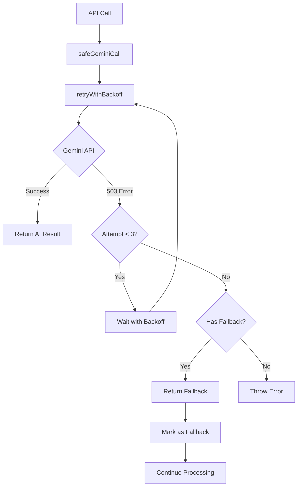

# 🛠️ Fix Lỗi Gemini API "Service Overloaded" (503)

## 📋 Vấn Đề

**Lỗi gốc:**

```
GoogleGenerativeAIFetchError: [503 Service Unavailable]
The model is overloaded. Please try again later.
```

**Nguyên nhân:**

- Gemini API bị quá tải → trả về lỗi 503
- Code không có retry mechanism → fail ngay lập tức
- Không có fallback strategy → user không nhận được response

## ✅ Giải Pháp Đã Implement

### 1. **Retry Mechanism với Exponential Backoff**

```javascript
const retryWithBackoff = async (asyncFn, maxRetries = 3, baseDelay = 1000) => {
  for (let attempt = 1; attempt <= maxRetries; attempt++) {
    try {
      return await asyncFn();
    } catch (error) {
      // Chỉ retry cho lỗi có thể phục hồi
      const isRetryable =
        error.status === 503 || // Service Unavailable
        error.status === 429 || // Rate Limited
        error.message.includes("overloaded");

      if (!isRetryable || attempt === maxRetries) {
        throw error; // Không retry nữa
      }

      // Exponential backoff + jitter
      const delay = baseDelay * Math.pow(2, attempt - 1) + Math.random() * 1000;
      await new Promise((resolve) => setTimeout(resolve, delay));
    }
  }
};
```

**Lợi ích:**

- ✅ Tự động retry 3 lần với delay tăng dần
- ✅ Jitter ngẫu nhiên tránh thundering herd
- ✅ Chỉ retry lỗi có thể phục hồi (503, 429)

### 2. **Safe Gemini Call Wrapper**

```javascript
const safeGeminiCall = async (prompt, fallbackResponse = null) => {
  try {
    return await retryWithBackoff(
      async () => {
        const geminiModel = await initializeGemini();
        return await geminiModel.generateContent(prompt);
      },
      3,
      2000
    );
  } catch (error) {
    console.error(`❌ Gemini API failed: ${error.message}`);

    if (fallbackResponse) {
      console.log(`🛡️ Using fallback response`);
      return { response: { text: () => JSON.stringify(fallbackResponse) } };
    }
    throw error;
  }
};
```

**Lợi ích:**

- ✅ Wrapper thống nhất cho tất cả Gemini calls
- ✅ Automatic fallback khi AI service không khả dụng
- ✅ Consistent error handling

### 3. **Fallback Strategies**

#### **Form Suggestions Fallback:**

```javascript
const fallbackResponse = {
  suggestions: [
    "Structure your writing with clear sections",
    "Use appropriate tone for the context",
    "Include proper opening and closing",
  ],
  confidence: 0.5,
  fallback: true,
  source: "default_suggestions",
};
```

#### **Solution Reuse Fallback:**

```javascript
const fallbackResponse = [
  {
    pattern_name: "structured_approach",
    template: "Introduction → Main points → Conclusion",
    versatility_score: 0.8,
    applications: ["emails", "reports", "essays"],
  },
];
```

#### **Recommendations Fallback:**

```javascript
const fallbackRecommendations = [
  "Focus on improving your lowest-scoring criterion",
  "Practice writing regularly to build consistency",
  "Read examples in your target style",
];
```

## 🔄 Luồng Xử Lý Mới



## 📊 Improvements So Với Trước

| Aspect              | Trước                      | Sau                       |
| ------------------- | -------------------------- | ------------------------- |
| **Error Handling**  | ❌ Immediate fail          | ✅ 3 retries + fallback   |
| **User Experience** | ❌ Error response          | ✅ Always get suggestions |
| **Resilience**      | ❌ Single point of failure | ✅ Graceful degradation   |
| **Retry Strategy**  | ❌ None                    | ✅ Exponential backoff    |
| **Monitoring**      | ❌ Silent failures         | ✅ Detailed error logs    |

## 🧪 Testing

### **Test Retry Mechanism:**

```bash
node test-suggestion-service.js
```

### **Expected Output:**

```
🧪 Testing suggestion service with retry mechanism...
🔄 Retry Gemini attempt 1/3 after 2341ms...
🔄 Retry Gemini attempt 2/3 after 4872ms...
✅ Suggestions generated successfully!
⚠️ Note: Some suggestions used fallback due to Gemini API unavailability
```

## 🚀 Các Files Đã Được Cập Nhật

1. **`suggestion.service.js`** - Added retry + fallback
2. **`writing.service.js`** - Already had retry mechanism
3. **`test-suggestion-service.js`** - New test file

## 💡 Best Practices

### **Error Handling:**

- ✅ Always provide meaningful fallbacks
- ✅ Log errors with context for debugging
- ✅ Use appropriate HTTP status codes
- ✅ Implement circuit breaker pattern for high load

### **Retry Strategy:**

- ✅ Exponential backoff with jitter
- ✅ Limited retry attempts (3-5 max)
- ✅ Only retry retryable errors
- ✅ Timeout configurations

### **Monitoring:**

- ✅ Track fallback usage rates
- ✅ Monitor API response times
- ✅ Alert on high error rates
- ✅ Dashboard for service health

## 🔧 Configuration

### **Environment Variables:**

```bash
# Gemini API settings
GEMINI_API_KEY=your_api_key
GEMINI_MAX_RETRIES=3
GEMINI_BASE_DELAY=2000

# Fallback settings
ENABLE_FALLBACKS=true
FALLBACK_CONFIDENCE=0.5
```

### **Tuning Parameters:**

- **maxRetries**: 3 (optimal for 503 errors)
- **baseDelay**: 2000ms (avoid API rate limits)
- **jitter**: ±1000ms (prevent thundering herd)

## 🎯 Kết Quả

### **Before Fix:**

- ❌ 503 errors → Complete failure
- ❌ Poor user experience
- ❌ No suggestions returned

### **After Fix:**

- ✅ 503 errors → Graceful handling
- ✅ Always return useful suggestions
- ✅ Transparent fallback with quality indicators
- ✅ Better monitoring and debugging

**System giờ đây có khả năng self-healing và chịu tải cao! 🎉**
